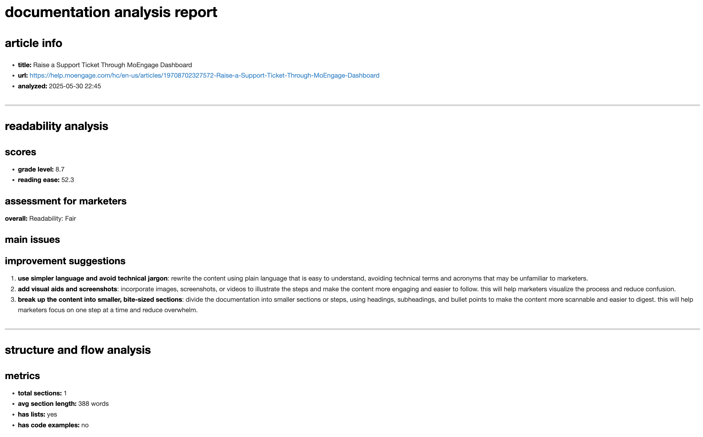
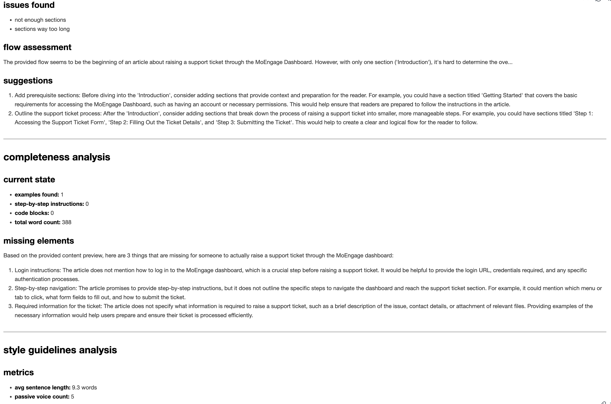
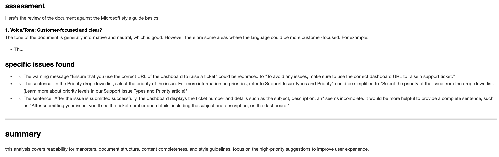

# doc-analyse

ai-powered documentation improvement tool for moengage docs

## what it does

takes a moengage documentation url and spits out suggestions on how to make it better. analyzes stuff like readability for marketers, content structure, completeness, and style guidelines.

## structure

### scraper
there's a [`scraper/`](https://github.com/dhruval30/doc-analyse/tree/main/scraper) directory with its own readme that explains how to extract content from moengage docs. uses playwright to handle the javascript-heavy pages since moengage help center loads content dynamically. the scraper navigates to the url, waits for all the article content to fully render, then extracts the main article text while filtering out navigation elements, sidebars, and other noise. cleans up the html and converts it to readable text format.

also got `scraper.ipynb` which does the same thing but in jupyter notebook form - good for testing individual urls or debugging scraping issues. handles edge cases like articles with different layouts or missing elements.

### analyzer
the main thing that does the actual analysis. takes the cleaned content from scraper and runs it through four evaluation criteria:

1. **readability for marketers** - combines flesch-kincaid readability scores with llm assessment to check if non-technical users can understand the content. looks at sentence complexity, jargon usage, and technical terms that need explanation.

2. **structure and flow** - analyzes heading hierarchy, paragraph lengths, use of lists/bullets, and logical information flow. checks if users can easily navigate and find what they need.

3. **completeness** - evaluates whether the article has enough detail for users to actually implement features. looks for missing examples, incomplete steps, or assumptions that aren't explained.

4. **style guidelines** - based on microsoft style guide principles, focuses on voice/tone, clarity, and action-oriented language. identifies overly complex sentences and suggests simplifications.

feeds everything to an llm with structured prompts and gets back actionable suggestions in json format. each suggestion is specific and tells you exactly what to fix rather than generic advice like "improve readability." utility for this will be coming soon to make it easier to run.

check out a sample improvement report here: https://github.com/dhruval30/doc-analyse/blob/main/analysis_Raise_a_Support_Ticket_Through.md

## setup

1. clone this repo
2. install dependencies - mainly playwright for scraping and your preferred llm api client
3. install playwright browsers: `playwright install`
4. add your llm api keys to environment variables (openai, claude, etc.)
5. check the scraper readme for specific setup instructions and any additional requirements

## usage

two-step process:
1. run the scraper first to extract clean content from the moengage url
2. feed the extracted content to the analyzer to get structured improvement suggestions

the scraper handles all the browser automation and content extraction, while the analyzer focuses on the llm-powered evaluation. keeps things modular so you can test each part separately.

more detailed instructions coming with the analyzer utility.

## notes

- focuses on backend analysis, no fancy ui needed
- uses llm apis for the heavy lifting on content evaluation  
- designed specifically for moengage help center articles (help.moengage.com)
- handles dynamic content loading and various article layouts
- outputs structured json reports that can be easily processed or displayed

## sample output

